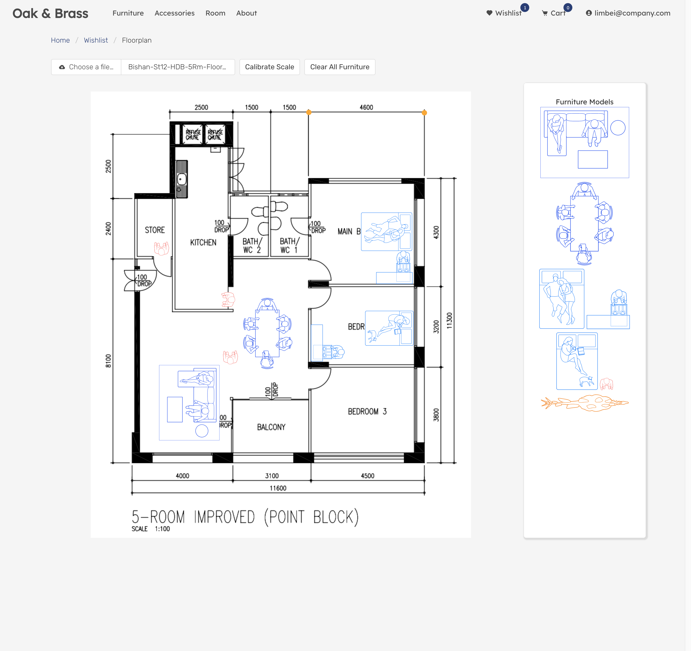

<meta charset="utf-8">
<meta name="viewport" content="width=device-width">
<link rel="stylesheet" href="./styles.css">
<link href="https://fonts.googleapis.com/css?family=Merriweather:300,400,700,900&display=swap" rel="stylesheet">

<main>
    

        
        
        
    

    <h3>2019 September 13</h3>
    <h3>Completed Software Engineering Immersive (SEI-19) @ <a href="https://generalassemb.ly/">General Assembly Singapore</a></h3>
    <h4><u>Acknowledgements</u></h4>
    In this world that we are passing through,
    We sometimes forget to say thank you.
    So before this moment slips away,
    There is one thing that I like to say,
    Thanks a million!!!
    
Special thanks to Akira Sinseh, Herda, Anthony, Khari and GA team for the 12 weeks of tender loving care ;) And also to all my course mates: best of luck in finding the dream job!

    

    <h4>My Projects</h4>
    <ul>
        <li><a href="https://marcykay.github.io/sei-19/project-1/game.html">Puzzle Game(Take It Easy) - Github Pages</a>
            <ul>
                <li>A two-dimensional puzzle game that requires the player to strategize and form continuous rows of same colour from edge to edge in order to score</li>
                <li>Playable by upto 2 players with 2 gameboards sizes</li>
                <li>Built with HTML5, CSS3, Javascript</li>
                
                
            </ul>
        </li>
        

        <li><a href="https://sei19takeanote.herokuapp.com">Take A Note - Heroku</a></li>
        <ul>
            <li>A full-stack mobile responsive note-taking web app</li>
            <li>Data are saved on the Heroku PostgreSQL server, images are saved on cloudinary</li>
            <li>Built with Node.js/Express/React.js/PostgreSQL/AJAX/Javascript/Materialize-CSS</li>
            <li>LoginID: "notes", Password: "password"</li>
            <li>LoginID: "holidaynotes", Password: "password"</li>
            
        </ul>
        

        <li><a href="https://oakandbrass.herokuapp.com/">Oak & Brass - Heroku</a></li>
        <ul>
            <li>A furniture e-commerce website</li>
            <li>Features includes Augmented Reality (AR) furniture placement; Space planning: move furniture simply by drag and drop on the user uploaded floor plan</li>
            <li>Integrates with Stripes Payment, 8th-Wall AR API</li>
            <li>Built on Ruby on Rails/PostgreSQL/Javascript/AJAX</li>
            <li>LoginID: "limbei@company.com", Password: "123456"</li>
            
            
        </ul>
        

        <li><a href="https://sei19-haveagoodday.herokuapp.com/">Have a Good Day - Heroku</a></li>
        <ul>
            <li>A dashboard based on React front-end frameworks which fetches data from NEA & LTA (APIs) to display weather and bus arrivals information</li>
            <li>User's preferences are saved on the Heroku PostgreSQL server</li>
            <li>Built with Node.js/Express/React.js/PostgreSQL/AJAX/Javascript</li>
            <li>LoginID: "user007", Password: "password"</li>
            
        </ul>
    </ul>
</main>

    
    
    

